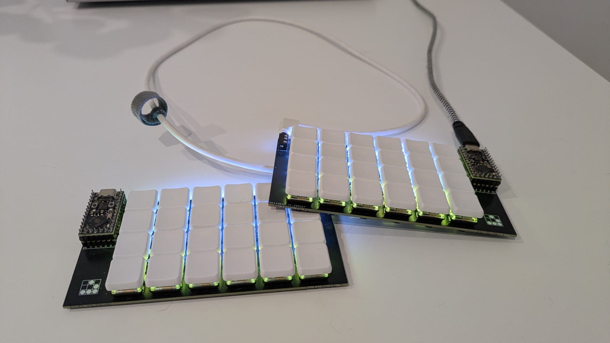

# Classic 48
A custom 48 key split keyboard

# Bill Of Materials
| Name | Quantity/Variety | Item Price (€) | Shipping (€) | Link |
|--|--|--|--|--|
|Brown Choc Switches|70 pcs|47.59|0|[AliExpress](https://www.aliexpress.com/item/1005005883472162.html?spm=a2g0o.order_list.order_list_main.199.2613194dDxt0T9)|
|Choc Keycaps|10 x B type (5 pcs each)|20|4.86|[AliExpress](https://www.aliexpress.com/item/1005007966026757.html?spm=a2g0o.order_detail.order_detail_item.2.1a644d1apVQ3mB)|
|Choc Blind Keycaps|1 x E type (5 pcs each)|2.99|4.86|[AliExpress](https://www.aliexpress.com/item/1005007966026757.html?spm=a2g0o.order_detail.order_detail_item.2.1a644d1apVQ3mB)|
|Soldering iron|1|19.69|0|[AliExpress](https://www.aliexpress.com/item/4000019437594.html?spm=a2g0o.order_detail.order_detail_item.3.5b734d1aqwuhYo)|
|SK6812 Mini-E LEDs|1 (100 pcs)|3.49|0.09|[AliExpress](https://www.aliexpress.com/item/1005002865070175.html?spm=a2g0o.order_detail.order_detail_item.3.394a4d1aan5FQG)|
|RP2040 Pro Micro|2|6.38|0|[AliExpress](https://www.aliexpress.com/item/1005006787060405.html?spm=a2g0o.order_detail.order_detail_item.3.7ac54d1aTYXgAB)|
|TRRS|1 (10 pcs)|2.11|0|[AliExpress](https://www.aliexpress.com/item/33029465106.html?spm=a2g0o.order_detail.order_detail_item.3.4e99f19crF5m72)|
|Soldering mount|1|8.09|0|[AliExpress](https://www.aliexpress.com/item/1005007045716674.html?spm=a2g0o.order_detail.order_detail_item.3.382bf19cIL4kQU)|
|Flux pen|1|1.01|0|[AliExpress](https://www.aliexpress.com/item/1005007346959832.html?spm=a2g0o.order_detail.order_detail_item.3.742df19cndnLH3)|
|Choc Hot Swap Sockets|1 x Type B (70 pcs)|5.89|0|[AliExpress](https://www.aliexpress.com/item/1005007232040760.html?spm=a2g0o.order_detail.order_detail_item.3.55faf19c1tKr8g)|
|SMD diode|1 1N4148W SOD123 (100 pcs)|1.08|0|[AliExpress](https://www.aliexpress.com/item/1005005707644429.html?spm=a2g0o.order_detail.order_detail_item.3.1c9df19csikjkj)|
|Multimeter|1|3.65|0|[AliExpress](https://www.aliexpress.com/item/1005007059884308.html?spm=a2g0o.order_detail.order_detail_item.3.1676f19c6qa6g1)|
|Desoldering braid|1 x 1.5mm 1.5m|1.59|0|[AliExpress](https://www.aliexpress.com/item/1005005398523384.html?spm=a2g0o.order_list.order_list_main.138.26131802A570A7)|
|Round female pin header|1 (10 pcs)|3.59|0.81|[AliExpress](https://www.aliexpress.com/item/33036413973.html?spm=a2g0o.order_detail.order_detail_item.3.7ef1f19cFHvYfp)|
|Round male pin header|1 (5 pcs)|2.00|1.31|[AliExpress](https://www.aliexpress.com/item/1005008053808682.html?spm=a2g0o.order_detail.order_detail_item.3.244ff19cC2E150)|
|PCB|1 (5 pcs)|10.26| 15.87 (shipping) + 29.14 (customs + handling fees DHL)|[JLCPCB](https://jlcpcb.com/)|

Grand total: **196.35 €**

# Installing the kicad libaries
1. Go to KiCad, `Preferences` -> `Configure Paths`, add new row with name `PJIMENEZ` and path to `pjimenez.kicad`
2. Go to KiCad, `Preferences` -> `Manage Footprint Libraries`, add new row with name `pjimenez` and path to `pjimenez.kicad/pjimenez.pretty`
3. Go to KiCad, `Preferences` -> `Manage Symbol Libraries`, add new row with name `pjimenez` and path to `pjimenez.kicad/pjimenez.kicad_sym`

# License
This project is licensed under Creative commons Attribution 3.0 Unported, more info : http://creativecommons.org/licenses/by/3.0/deed.en_US
